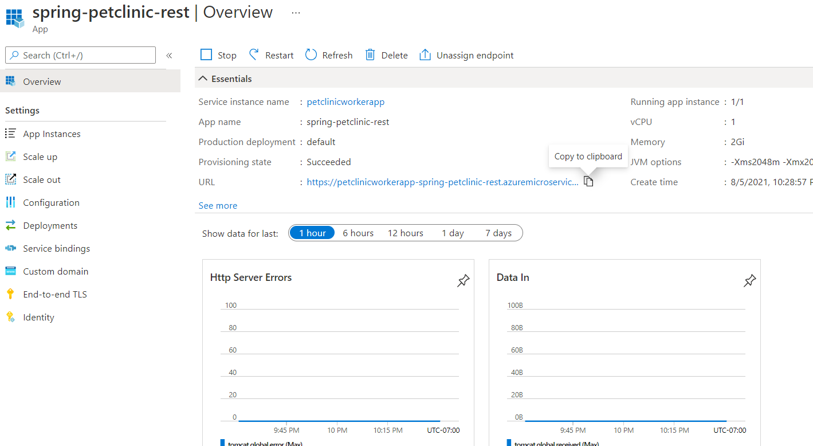
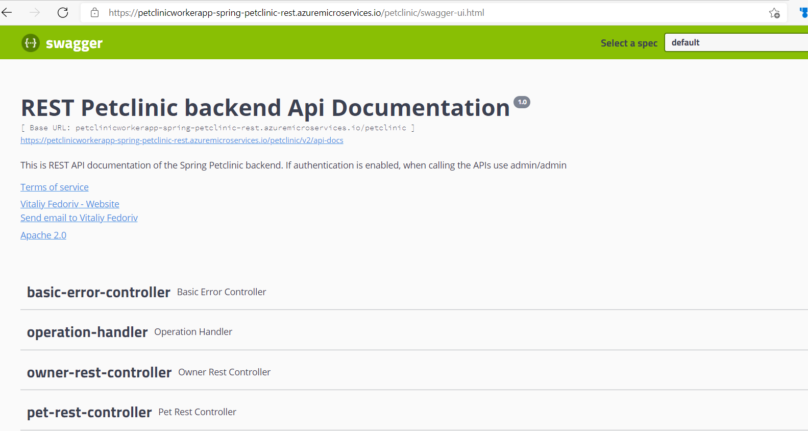

# REST version of Spring PetClinic Sample Application on Azure Spring Cloud

This backend version of the Spring Petclinic application only provides a REST API. **There is no UI**.
The [spring-petclinic-angular project](https://github.com/spring-petclinic/spring-petclinic-angular) is a Angular front-end application which consumes the REST API.

## Understanding the Spring Petclinic application with a few diagrams

[See the presentation of the Spring Petclinic Framework version](http://fr.slideshare.net/AntoineRey/spring-framework-petclinic-sample-application)

### Petclinic ER Model


## Running petclinic locally

### With maven command line
```
git clone https://github.com/selvasingh/spring-petclinic-rest.git
cd spring-petclinic-rest
git checkout Azure
mvn clean package
```

### With Docker
```
docker run -p 9966:9966 springcommunity/spring-petclinic-rest
```

You can then access petclinic here: [http://localhost:9966/petclinic/](http://localhost:9966/petclinic/)

There are actuator health check and info routes as well: 
* [http://localhost:9966/petclinic/actuator/health](http://localhost:9966/petclinic/actuator/health)
* [http://localhost:9966/petclinic/actuator/info](http://localhost:9966/petclinic/actuator/info)

## Running Spring Petclinic in Azure Spring Cloud

### Install the Azure CLI extension

Install the Azure Spring Cloud extension for the Azure CLI using the following command

```bash
    az extension add --name spring-cloud
```
Note - `spring-cloud` CLI extension `2.1.0` or later is a pre-requisite to enable the
latest Java in-process agent for Application Insights. If you already 
have the CLI extension, you may need to upgrade to the latest using --

```bash
    az extension update --name spring-cloud
```
### Provision Azure Spring Cloud service instance using Azure CLI

### Prepare your environment for deployments
Set the following environment variables required in the Azure Spring Cloud deployment below.

```bash

    export SUBSCRIPTION=subscription-id # customize this
    ...
    export RESOURCE_GROUP=resource-group-name # customize this
    ...
    export REGION=westus2 # customize this
    ...
    export SPRING_CLOUD_SERVICE=azure-spring-cloud-name # customize this
    ...
```
### Login to Azure 
Login to the Azure CLI and choose your active subscription. Be sure to choose the active subscription that is whitelisted for Azure Spring Cloud

```bash
    az login
    az account list -o table
    az account set --subscription ${SUBSCRIPTION}
```

### Create Azure Spring Cloud service instance
Prepare a name for your Azure Spring Cloud service.  The name must be between 4 and 32 characters long and can contain only lowercase letters, numbers, and hyphens.  The first character of the service name must be a letter and the last character must be either a letter or a number.

Create a resource group to contain your Azure Spring Cloud service.

```bash
    az group create --name ${RESOURCE_GROUP} \
        --location ${REGION}
```

### Create an instance of Azure Spring Cloud.

```bash
    az spring-cloud create --name ${SPRING_CLOUD_SERVICE} \
        --sku standard --enable-java-agent \
        --resource-group ${RESOURCE_GROUP} \
        --location ${REGION}
```

The service instance will take around five minutes to deploy.

Set your default resource group name and cluster name using the following commands:

```bash
    az configure --defaults \
        group=${RESOURCE_GROUP} \
        location=${REGION} \
        spring-cloud=${SPRING_CLOUD_SERVICE}
```

### Create microservice applications

Create a microservice app.

```bash
    az spring-cloud app create --name spring-petclinic-rest --instance-count 1 --assign-endpoint true \
        --memory 2 \
        --jvm-options='-Xms2048m -Xmx2048m'
```


### Deploy applications and set environment variables

Deploy Spring Petclinic rest application to Azure.

```bash
    az spring-cloud app deploy --name spring-petclinic-rest \
        --jar-path target/spring-petclinic-rest-2.4.2.jar \
        --jvm-options='-Xms2048m -Xmx2048m'
```

## Swagger REST API documentation presented here (after application start):
Copy the assigned url from the portal for the spring petclinic application as shown below and append **/petclinic** to the URL.



Your Swagger UI should show all the Rest endpoints in the project lke shown below.
 

 

## Screenshot of the Angular client

If you run the Angular client by building Spring Petclinic Angular project then you will see the end to end application running like shown below. 


## Credits

This Spring petclinic rest sample is forked from 
[spring-petclinic/spring-petclinic-rest](https://github.com/spring-petclinic/spring-petclinic-rest). 

## Contributing

This project welcomes contributions and suggestions.  Most contributions require you to agree to a
Contributor License Agreement (CLA) declaring that you have the right to, and actually do, grant us
the rights to use your contribution. For details, visit https://cla.opensource.microsoft.com.

When you submit a pull request, a CLA bot will automatically determine whether you need to provide
a CLA and decorate the PR appropriately (e.g., status check, comment). Simply follow the instructions
provided by the bot. You will only need to do this once across all repos using our CLA.

This project has adopted the [Microsoft Open Source Code of Conduct](https://opensource.microsoft.com/codeofconduct/).
For more information see the [Code of Conduct FAQ](https://opensource.microsoft.com/codeofconduct/faq/) or
contact [opencode@microsoft.com](mailto:opencode@microsoft.com) with any additional questions or comments.